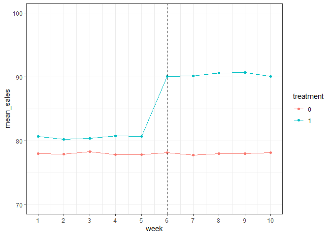
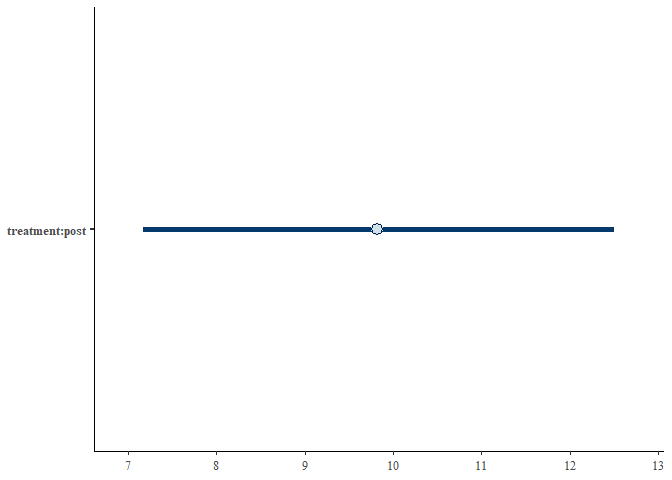
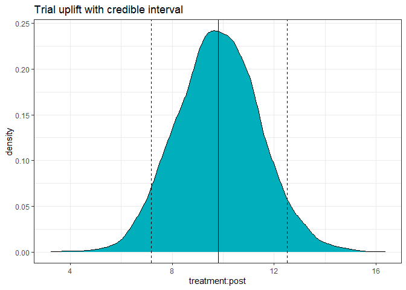
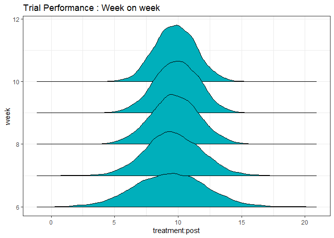
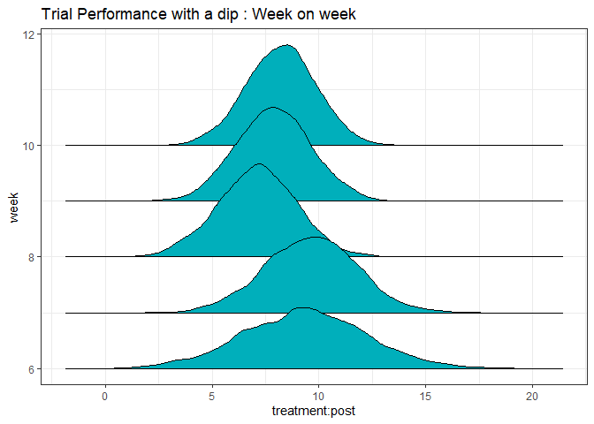

Bayesian Difference-in-differences (DiD)
================
Omkar Shetty
2021-10-23

In another notebook, we explored the idea of using
difference-in-differences to measure the impact of a trial. In this
notebook, we will attempt a Bayesian version of the DiD calculation.
Setting it up to run on multiple cores - although it may not be
necessary for this example. Also, suppreseing warnings temprarily.

``` r
options(mc.cores = parallel::detectCores(), warn = -1)
```

Loading libraries

``` r
library(data.table)
library(ggplot2)
library(ggridges)
library(optiRum)
library(rstanarm)
```

    ## Loading required package: Rcpp

    ## This is rstanarm version 2.21.1

    ## - See https://mc-stan.org/rstanarm/articles/priors for changes to default priors!

    ## - Default priors may change, so it's safest to specify priors, even if equivalent to the defaults.

    ## - For execution on a local, multicore CPU with excess RAM we recommend calling

    ##   options(mc.cores = parallel::detectCores())

## Trial Data and Setup

This is exactly the same data as used in the [comparison of measurement
methods](https://github.com/omkar-shetty/trial_measurement/blob/master/notebooks/compare_measurement_methods.md).

``` r
config <- list(
  ttl_customers = 10000,
  trial_smp_size = 1000,
  prop_ctrl_grp = 0.5,
  num_trials = 1,
  sales_param_rng = c(10,150),
  sd_sales_param = 5,
  trial_duration_wks = 10,
  pre_trial_weeks = 5
)

cust_dt <- data.table(cust_id = paste0('CN',1:config$ttl_customers),
                      sales_param = runif(min = config$sales_param_rng[1],
                                          max = config$sales_param_rng[2],
                                          n = config$ttl_customers))

trial_cust <- sample(cust_dt[,unique(cust_id)], config$trial_smp_size, replace = F)
trial_cust_dt <- cust_dt[cust_id %in% trial_cust,]

trial_cust_dt[,treatment := ifelse(cust_id %in% sample(unique(trial_cust_dt$cust_id),
                                                       size = config$prop_ctrl_grp*nrow(trial_cust_dt),replace = F),0,1)]

ttl_dt <- CJ.dt(trial_cust_dt,data.table(week = c(1:config$trial_duration_wks)))
ttl_dt[,sales := rnorm(sales_param,mean = sales_param, sd = config$sd_sales_param)]
ttl_dt[,post := ifelse(week > config$pre_trial_weeks,1,0)]

head(ttl_dt)
```

    ##    cust_id sales_param treatment week     sales post
    ## 1:    CN16   109.97929         1    1 109.67661    0
    ## 2:    CN25    26.75730         1    1  24.75188    0
    ## 3:    CN35   133.56726         1    1 137.91870    0
    ## 4:    CN40   138.66112         1    1 134.63660    0
    ## 5:    CN42   141.88852         1    1 141.85100    0
    ## 6:    CN47    57.54394         1    1  60.71693    0

## Adding An Uplift

``` r
config[['uplift_mean']] = 10
config[['uplift_sd']] = 5

act_uplift <- rnorm(ttl_dt[post ==1 & treatment ==1,.N],config$uplift_mean, config$uplift_sd)
ttl_dt[, uplift := 0]
ttl_dt[post == 1 & treatment == 1, uplift := act_uplift]
ttl_dt[,sales := sales + uplift]
```

SImilar to the previous DiD analysis, we compare the time series plots
to ensure that the paralleism constraint is met

``` r
ggplot(data = ttl_dt[,.(mean_sales = mean(sales)),.(week,treatment)]) +
  geom_line(aes(x = week, y = mean_sales, col = as.factor(treatment))) + 
  geom_point(aes(x = week, y = mean_sales, col = as.factor(treatment))) + 
  theme_bw() + 
  geom_vline(aes(xintercept = ttl_dt[post == 1, min(week)]), linetype = 'dashed') +
  scale_x_continuous(limits = c(1, 10), breaks = seq(1, 10, by = 1)) +
  ylim(c(70,100))+
  labs(colour = 'treatment')
```

<!-- -->

## Fitting a Bayesian Linear Model

Here we use a Bayesian implementation of the Difference in Differences
(DiD) approach. The linear regression model is defined exactly the same
as it was earlier, the only difference being we need to specify a prior
distribution. In this case, we use an R2 prior - however, in the future
we could replace the priors to analysze how sensitive the uplift
calculations are to the choice of the prior.

``` r
b_fit = rstanarm::stan_lm(formula = 'sales ~ treatment + post + treatment:post', 
                          data = ttl_dt,
                          prior = R2(location = 0.5, what = "mean"))
summary(b_fit)
```

    ## 
    ## Model Info:
    ##  function:     stan_lm
    ##  family:       gaussian [identity]
    ##  formula:      "sales ~ treatment + post + treatment:post"
    ##  algorithm:    sampling
    ##  sample:       4000 (posterior sample size)
    ##  priors:       see help('prior_summary')
    ##  observations: 10000
    ##  predictors:   4
    ## 
    ## Estimates:
    ##                  mean   sd   10%   50%   90%
    ## (Intercept)    78.0    0.8 77.0  78.0  79.0 
    ## treatment       2.5    1.2  1.1   2.5   4.0 
    ## post            0.0    1.1 -1.5  -0.1   1.5 
    ## treatment:post  9.8    1.6  7.7   9.8  11.9 
    ## sigma          40.6    0.3 40.3  40.6  41.0 
    ## log-fit_ratio   0.0    0.0  0.0   0.0   0.0 
    ## R2              0.0    0.0  0.0   0.0   0.0 
    ## 
    ## Fit Diagnostics:
    ##            mean   sd   10%   50%   90%
    ## mean_PPD 81.7    0.6 81.0  81.7  82.5 
    ## 
    ## The mean_ppd is the sample average posterior predictive distribution of the outcome variable (for details see help('summary.stanreg')).
    ## 
    ## MCMC diagnostics
    ##                mcse Rhat n_eff
    ## (Intercept)    0.0  1.0  2414 
    ## treatment      0.0  1.0  3044 
    ## post           0.0  1.0  3286 
    ## treatment:post 0.0  1.0  3567 
    ## sigma          0.0  1.0  3237 
    ## log-fit_ratio  0.0  1.0  3192 
    ## R2             0.0  1.0  2688 
    ## mean_PPD       0.0  1.0  4094 
    ## log-posterior  0.1  1.0   964 
    ## 
    ## For each parameter, mcse is Monte Carlo standard error, n_eff is a crude measure of effective sample size, and Rhat is the potential scale reduction factor on split chains (at convergence Rhat=1).

Highlighting the spread for the uplift / the treatment:post variable.

``` r
plot(b_fit, prob = 0.9, pars = 'treatment:post')
```

<!-- -->

Extracting samples from the fit - Here with the 1000 samples, we can
create a distribution of the uplift. Quite often it is useful to
communicate not only the mean (or median uplift) but also a degree of
uncertainity (for example using the 90% credible interval).

``` r
x = as.data.frame(b_fit)
ggplot(data = x) +
  geom_density(aes(x = `treatment:post`), bins = 20, fill = '#00AFBB') +
  geom_vline(aes(xintercept = median(x$`treatment:post`))) +
  geom_vline(aes(xintercept = quantile(x$`treatment:post`, 0.05)), linetype = 'dashed') +
  geom_vline(aes(xintercept = quantile(x$`treatment:post`, 0.95)), linetype = 'dashed') +
  theme_bw() + 
  ggtitle('Trial uplift with credible interval')
```

<!-- -->

## Tracking the performance over time

ANother useful tool is to track the performance of a trial over time to
ensure consitency.

``` r
weekly_op = lapply(X = ttl_dt[post == 1, unique(week)], FUN = function(x){
                    fit = rstanarm::stan_lm(formula = 'sales ~ treatment + post + treatment:post', 
                          data = ttl_dt[week <= x,],
                          prior = R2(location = 0.5, what = "mean"))
                    fit_smps = as.data.frame(fit)
                    fit_smps = cbind(fit_smps, week = x)
                                return(fit_smps)})

weekly_op = rbindlist(weekly_op)

ggplot(weekly_op, aes(x = `treatment:post`, y = week, group = week)) + 
  geom_density_ridges2(fill = "#00AFBB") +
  theme_bw() +
  ggtitle('Trial Performance : Week on week')
```

    ## Picking joint bandwidth of 0.348

<!-- -->

So based on the ridgeplot above, we can conclude a few things - the
average effect seems to remain consistent week-on-week, (which is
aligned with how the underlying data was defined). In addition, for the
final weeks of the trial, the distribution of the uplift becomes more
peaky and pronounced, indicating higher confidence in the result (in
comparison, for the earlier weeks , the distribution is a little more
spread out.)  
This view becomes more relevant when there is a potential for trials to
get impacted by extraneous factors. \#\# Introducing an artificial dip
in the data To further stress test the analysis, we introduce a
significant dip in one of weeks. As is seen from the graph below, the
distributions for the forst two weeks are almost exactly what we had
seen earlier. However, following the dip, the uplift distributions for
subsequent weeks is no longer the same.  
In fact, as we would expect, the level of confidence in the final uplift
seems to have dropped.

``` r
dip_dt = ttl_dt[week == 8 & treatment == 1, sales := sales - 8]

weekly_op2 = lapply(X = dip_dt[post == 1, unique(week)], FUN = function(x){
  fit = rstanarm::stan_lm(formula = 'sales ~ treatment + post + treatment:post', 
                          data = dip_dt[week <= x,],
                          prior = R2(location = 0.5, what = "mean"))
  fit_smps = as.data.frame(fit)
  fit_smps = cbind(fit_smps, week = x)
  return(fit_smps)})

weekly_op2 = rbindlist(weekly_op2)

ggplot(weekly_op2, aes(x = `treatment:post`, y = week, group = week)) + 
  geom_density_ridges2(fill = "#00AFBB") +
  theme_bw()+
  ggtitle('Trial Performance with a dip : Week on week')
```

    ## Picking joint bandwidth of 0.349

<!-- -->
