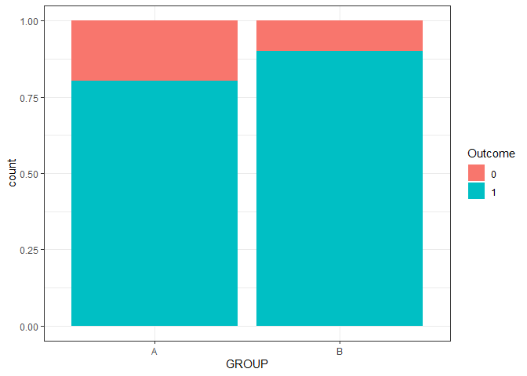

Binary Trial Design \[WIP\]
================
Omkar Shetty
2021-10-18

Testing a few approaches to compare and contrast different methodologies
for trials with a binary outcome (success/failure trials).

``` r
library(data.table)
```

    ## Warning: package 'data.table' was built under R version 3.6.3

``` r
library(oddsratio)
```

    ## Warning: package 'oddsratio' was built under R version 3.6.3

``` r
library(ggplot2)
```

## Setup Trial Data and Configuration

Defining trial parameters

``` r
trial_config <- list(
  groups = LETTERS[1:2],
  time_units = 30,
  group_a = 0.8,
  group_b = 0.9,
  n = 100
)
```

For this toy example, lets assume that a retail chain has a new process
to improve on-shelf availability of products. One way of testing if the
new process is significantly better is by trialling two different groups
i.e., one with the new process and the control group with the regular
process.

The questions that we want to answer are :  
\- Is the new process *significantly* better than the original ?  
\- If yes, what is the difference between the groups ?  
\- Is the trial enough for us to arrive at a conclusion ?  
Calculating the odds ratio based on the specified frequencies

``` r
actual_odds_ratio = ((trial_config$group_b)/(1 - trial_config$group_b))/((trial_config$group_a)/(1 - trial_config$group_a))
actual_odds_ratio
```

    ## [1] 2.25

## Generating Simulated Trial Data

Here, the outcome column represents whether or not a particular item was
available in the specified group on the specified time.

``` r
set.seed(123)

trial_data <- data.table(
  GROUP = rep(trial_config$groups, each = trial_config$time_units * trial_config$n),
  TIME = rep(1:trial_config$time_units, each = trial_config$n * length(trial_config$groups)),
  OUTCOME = c(rbinom(n = trial_config$n * trial_config$time_units, size = 1, prob = trial_config$group_a),rbinom(n = trial_config$n * trial_config$time_units, size = 1, prob = trial_config$group_b))
)

head(trial_data)
```

    ##    GROUP TIME OUTCOME
    ## 1:     A    1       1
    ## 2:     A    1       1
    ## 3:     A    1       1
    ## 4:     A    1       0
    ## 5:     A    1       0
    ## 6:     A    1       1

``` r
## Confusion Matrix of the outcome  
```

What are the counts of the successes and failures within each group.

``` r
table(trial_data$GROUP, trial_data$OUTCOME)
```

    ##    
    ##        0    1
    ##   A  592 2408
    ##   B  295 2705

The odds ratio here is about 2.25 which implies a positive effect for
group B (as the odds ratio \> 1) (As a reminder, the odds ratio in this
case is the ratio of the odds of Group B to the odds of Group A ). Based
on these figures, the odds are 2.25 times higher that items from Group B
will be available.  
However, we still don’t know if the odds ratio is statisticlly
significant.

``` r
# Visualizing the split between the groups

ggplot(trial_data) +
  aes(x = GROUP, fill = as.factor(OUTCOME)) +
  geom_bar(position = "fill") +
  theme_bw() +
  labs(fill = 'Outcome')
```

<!-- -->

## Chi Squared Test

Using a chi-square test is a standard way to calculate the p-value. The
Chi-square test compares the observed values of the outcome to the
expected values - assuming that there isn’t a relation between the group
and the outcome.

``` r
trial_data[,OUTCOME := as.factor(OUTCOME)]
chisq.test(table(trial_data$GROUP, trial_data$OUTCOME))
```

    ## 
    ##  Pearson's Chi-squared test with Yates' continuity correction
    ## 
    ## data:  table(trial_data$GROUP, trial_data$OUTCOME)
    ## X-squared = 115.91, df = 1, p-value < 2.2e-16

The p-value does seem to indicate a statistically significant result.

## Logistic Regression

Another approach to estimate the odds ratio is by using logistic
regression.  
Here, the GroupB coefficient can be used to calculate the odds ratio.

``` r
fit1 <- glm(formula = 'OUTCOME ~ GROUP', family = binomial, data = trial_data)
summary(fit1)
```

    ## 
    ## Call:
    ## glm(formula = "OUTCOME ~ GROUP", family = binomial, data = trial_data)
    ## 
    ## Deviance Residuals: 
    ##     Min       1Q   Median       3Q      Max  
    ## -2.1538   0.4550   0.4550   0.6631   0.6631  
    ## 
    ## Coefficients:
    ##             Estimate Std. Error z value Pr(>|z|)    
    ## (Intercept)  1.40305    0.04587   30.58   <2e-16 ***
    ## GROUPB       0.81284    0.07657   10.62   <2e-16 ***
    ## ---
    ## Signif. codes:  0 '***' 0.001 '**' 0.01 '*' 0.05 '.' 0.1 ' ' 1
    ## 
    ## (Dispersion parameter for binomial family taken to be 1)
    ## 
    ##     Null deviance: 5027.2  on 5999  degrees of freedom
    ## Residual deviance: 4908.5  on 5998  degrees of freedom
    ## AIC: 4912.5
    ## 
    ## Number of Fisher Scoring iterations: 4

Calculating the odds ratio

``` r
exp(coef(summary(fit1))["GROUPB","Estimate"])
```

    ## [1] 2.254294

As in the previous case, using Chi square, the value of the odds ratio
matches the original as well as the effect is statistically
significant.  
Using the odds ratio package, the confidence interval of the estimated
odds ratio can also be calculated.

``` r
or_glm(data = trial_data, model = fit1)
```

    ##   predictor oddsratio ci_low (2.5) ci_high (97.5)          increment
    ## 1    GROUPB     2.254        1.942          2.622 Indicator variable

## Additional Metrics

In additon to the odds ratio, metrics such as the relative difference
can also be useful in estimating the effect. Estimating the proprtion
for each group

``` r
pB = exp(1.403 + 0.8128)/(1 + exp(1.403 + 0.8128))
pB
```

    ## [1] 0.9016594

``` r
pA = exp(1.403)/(1 + exp(1.403))
pA
```

    ## [1] 0.8026595

Calculating the relative difference (RD) over the study population

``` r
trial_data[,TREAT := ifelse(GROUP == 'A',0,1)]
trial_data[,pB_est := exp(coef(fit1)["(Intercept)"] + TREAT*coef(fit1)["GROUPB"])]
trial_data[,pA_est := exp(coef(fit1)["(Intercept)"])]
trial_data[,pA_diff := pB_est - pA_est]

RD_est = trial_data[,sum(pA_diff)]/trial_data[,.N]
RD_est
```

    ## [1] 2.550962

So far using a few methods, we could confirm that there is indeed a
significant difference between the two groups.
