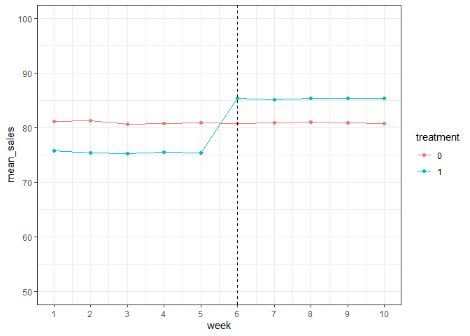

Comparison of Trial Measurement Methodologies
================
Omkar Shetty
2021-10-17

The objective of this analysis is to compare some standard trial
measurement approaches for a specific scenario and identify some pros
and cons.

\*Problem Overview A retail chain uses a recommender system to suggest
products that the customer might not have purchased earlier. (This
notebook won’t delve into the specifics of how such a system might
work). THe hypothesies is that these customers who receive
recommendations spend more than the other customers. THis motebook aims
to design an approach that might identify such an uplift.

``` r
library(data.table)
```

    ## Warning: package 'data.table' was built under R version 3.6.3

``` r
library(stringi)
library(ggplot2)
library(optiRum)
```

    ## Warning: package 'optiRum' was built under R version 3.6.3

## Setup Trial Data and Configuration

We start by setting up the trial config, including some parameters to
create a trial dataset

``` r
config <- list(
  ttl_customers = 10000,
  trial_smp_size = 1000,
  prop_ctrl_grp = 0.5,
  num_trials = 1,
  sales_param_rng = c(10,150),
  sd_sales_param = 5,
  trial_duration_wks = 10,
  pre_trial_weeks = 5
)
```

Defining a set of total customers with a ‘sales parameter’ for each
cutomer. This parameter would define how much they are likely to spend
each week at this store.

``` r
cust_dt <- data.table(cust_id = paste0('CN',1:config$ttl_customers),
                       sales_param = runif(min = config$sales_param_rng[1],
                                           max = config$sales_param_rng[2],
                                           n = config$ttl_customers))
```

The trial would be conducted on a subset of customers. (Given that some
trials can be expensive to setup and execute, this is a pretty common
scenario in the real world.)

``` r
# Create subset of customers for trial

trial_cust <- sample(cust_dt[,unique(cust_id)], config$trial_smp_size, replace = F)
trial_cust_dt <- cust_dt[cust_id %in% trial_cust,]

# Splitting between treatment and control groups

trial_cust_dt[,treatment := ifelse(cust_id %in% sample(unique(trial_cust_dt$cust_id),
                                                       size = config$prop_ctrl_grp*nrow(trial_cust_dt),replace = F),0,1)]
```

Assigning some default sales to all customers for all weeks under
consideration In reality, only a limited number of customers might shop
with this level of consistency

``` r
ttl_dt <- CJ.dt(trial_cust_dt,data.table(week = c(1:config$trial_duration_wks)))
ttl_dt[,sales := rnorm(sales_param,mean = sales_param, sd = config$sd_sales_param)]
ttl_dt[,post := ifelse(week > config$pre_trial_weeks,1,0)]
```

Snapshot of the data

``` r
head(ttl_dt)
```

    ##    cust_id sales_param treatment week     sales post
    ## 1:     CN5   107.43003         0    1  99.83168    0
    ## 2:     CN6    95.18938         1    1  94.80281    0
    ## 3:    CN15    35.58167         0    1  32.66246    0
    ## 4:    CN25   103.35007         1    1 102.62513    0
    ## 5:    CN35    62.74235         0    1  63.09966    0
    ## 6:    CN36    13.80381         0    1  18.39021    0

## Measurement Methodologies

Now that we have a sample trial dataset ready, we will set up functions
to test uplifts. For this analysis, we will use two approaches - the
ratio method and the Difference in Differences (DiD) method.

\*\* Ratio Method \*\*

Starting with defining the ratio based method - This is a basic approach
to get a quick read of a trial performance THe ratio of the metric in
trial and control stores is assumed to reman consistent in the pre and
post period, so any improvement in the metric in the trial group in the
post period is assumed to be due to the intervention.

``` r
calc_ratio_up <- function(config,dat){
  mean_dat <- dat[,.(mean_val = mean(sales)),.(post,treatment)]
  uplift <- mean_dat[post == 1 & treatment == 1, mean_val] - 
            mean_dat[post == 0 & treatment == 1, mean_val]/mean_dat[post == 0 & treatment == 0, mean_val]*mean_dat[post == 1 &    treatment == 0, mean_val]
  
  return(uplift)
}
```

\*\* Difference-in-differences (DiD)\*\*

In this implementation, the metric to be measured is setup as a linear
regression with the coefficient of the ’treatment::post term returning
the value of the uplift. In this function, we are also returning the
confidence interval of the coefficient (to get a measure of the
uncertainity)

``` r
calc_did_up <- function(config, dat){
  
  fit1 <- lm(formula = 'sales ~ treatment + post + treatment:post', data = dat)
  uplift <- summary(fit1)$coefficients[4]
  conf_int <- confint(fit1)[c(4,8)]
  
  return(list(uplift = uplift,
              conf_int = conf_int))
}
```

## A/A Testing

Before we start measuring some actual uplifts, we need to test some
scenarios to make sure that we are not unintentionally capturing any
stray signals. To start with we’ll test both our methodologies with the
current dataset (which shouldnt result in any uplift),

``` r
uplift_rat <- calc_ratio_up(config, ttl_dt)
uplift_rat
```

    ## [1] 0.03505517

Now with the DiD Both methods return a negligible effect and the
confidence interval for the did measurement includes 0, so the results
are what we would expect to see.

``` r
uplift_rat2 <- calc_did_up(config, ttl_dt)
uplift_rat2$uplift
```

    ## [1] 0.03760252

``` r
uplift_rat2$conf_int
```

    ## [1] -3.101807  3.177012

## Incorporating an additive uplift

Lets assume that customers subjected to the product recommendations
spend about $10 more than if they were not sent those
recommendations.Also, we’ll add in some noise to the data to see how
difficult it is to retrieve this information. Adding some uplift
parameters to the config.

``` r
config[['uplift_mean']] = 10
config[['uplift_sd']] = 5
```

Now updating the trial data with the uplift info

``` r
act_uplift <- rnorm(ttl_dt[post ==1 & treatment ==1,.N],config$uplift_mean, config$uplift_sd)
ttl_dt[, uplift := 0]
ttl_dt[post == 1 & treatment == 1, uplift := act_uplift]

#Calculating updated sales
ttl_dt[,sales := rnorm(sales_param,mean = (sales_param + uplift), sd = config$sd_sales_param)]
```

One of the assumptions for DiD is that the trial and control groups
should retain a parallel trend in the pre-period Verifying that
asumption now -

``` r
ggplot(data = ttl_dt[,.(mean_sales = mean(sales)),.(week,treatment)]) +
  geom_line(aes(x = week, y = mean_sales, col = as.factor(treatment))) + 
  geom_point(aes(x = week, y = mean_sales, col = as.factor(treatment))) + 
  theme_bw() + 
  geom_vline(aes(xintercept = ttl_dt[post == 1, min(week)]), linetype = 'dashed') +
  scale_x_continuous(limits = c(1, 10), breaks = seq(1, 10, by = 1)) +
  ylim(c(50,100))+
  labs(colour = 'treatment')
```

<!-- -->

Based on the graph above, it seems that the parallel lines assumption is
valid, making it safe to use DiD on this dataset.

## Measure the Uplift

``` r
uplift_new <- calc_ratio_up(config,ttl_dt)
uplift_new
```

    ## [1] 9.948546

Now with DiD

``` r
uplift_new2 <- calc_did_up(config,ttl_dt)
uplift_new2$uplift
```

    ## [1] 9.952808

``` r
uplift_new2$conf_int
```

    ## [1]  6.806855 13.098761

In both cases, the uplift measurement seems to align with the actual
impact.
